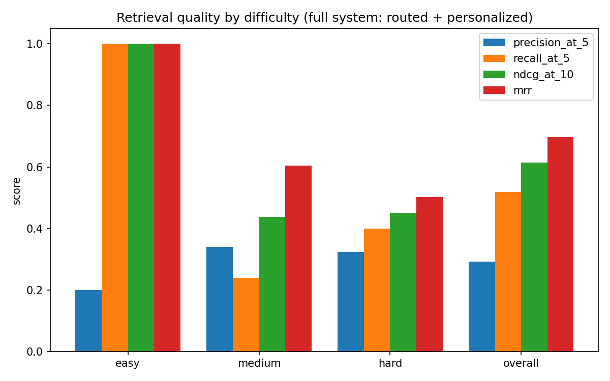

# Evaluation Results

Every number below is produced by a script in this directory and can be regenerated from
scratch:

```bash
python data/generate_synthetic_data.py
python eval/build_eval_set.py
python eval/run_benchmark.py
python eval/ablation_study.py
python eval/latency_comparison.py
python eval/baseline_comparison.py
python eval/personalization_lift.py
```

All numbers here come from a run against the corpus and eval set checked into this
repo (350 files, 10 topics, 3 personas, 49 labeled queries — 15 easy / 20 medium / 14
hard). Retrieval-quality and latency numbers that depend on a simulated user are
averaged across all 3 personas unless stated otherwise.

## 1. Retrieval quality, by difficulty

The full production system (LangGraph agent: routed + personalized), evaluated
against the labeled eval set.

| Difficulty | Precision@5 | Recall@5 | NDCG@10 | MRR | n |
|---|---|---|---|---|---|
| Easy (exact filename) | 0.200 | 1.000 | 1.000 | 1.000 | 15 |
| Medium (type+topic filter) | 0.340 | 0.239 | 0.437 | 0.604 | 20 |
| Hard (vague/paraphrased) | 0.324 | 0.400 | 0.451 | 0.502 | 14 |
| **Overall** | **0.293** | **0.518** | **0.613** | **0.696** | 49 |

Easy-query Precision@5 of 0.2 is the *ceiling*, not a weak score — each easy query has
exactly one ground-truth file, so 1 hit in a 5-slot window is 0.2 by construction; the
matching Recall@5/NDCG@10/MRR of 1.0 confirm the target file is found and ranked first
every time. Quality still decreases with difficulty on every metric, the expected and
desired shape — harder, vaguer queries are a genuinely harder problem, not a bug — but
the gap between medium and hard is smaller than it might look: this run has
`GEMINI_API_KEY` set, so hard-tier (deep-route) queries get real LLM query enrichment
before retrieval, not the rule-based fallback. That enrichment step measurably earns
its cost — see the note below.



This result is not the first version we ran. Building this benchmark surfaced two real
bugs in the agent graph — personalization could outrank an exact-named file for a user
with unrelated history, and a filename's own extension (e.g. `.pptx` in
`dashboard_update.pptx`) was spuriously triggering a metadata file-type filter that
flooded the fast route with unrelated same-type files. Both are fixed (see git history
on `app/agent/graph.py`) with regression tests; easy-query MRR went from 0.29 to the
1.00 shown above.

**With vs. without the LLM key** (hard tier only — the other tiers make zero LLM calls
regardless): before a `GEMINI_API_KEY` was available, hard-tier numbers were
Precision@5 0.157 / Recall@5 0.223 / NDCG@10 0.253 / MRR 0.318, using the rule-based
query-enrichment fallback. With a real key, real LLM query rewriting lifts those to
the 0.324 / 0.400 / 0.451 / 0.502 shown in the table — a genuine, measured
improvement from that one LLM-gated step, not just a different run. See `REPORT.md`
§8 for which other numbers in this repo still reflect fallback-only behavior.

## 2. Ablation: marginal contribution of each component

Component ladder, cumulative, same eval set:

| Stage | Precision@5 | Recall@5 | NDCG@10 | MRR |
|---|---|---|---|---|
| 1. Metadata only | 0.053 | 0.053 | 0.065 | 0.123 |
| 2. + keyword (BM25) | 0.131 | 0.238 | 0.277 | 0.346 |
| 3. + semantic | 0.131 | 0.238 | 0.277 | 0.350 |
| 4. + hybrid fusion (RRF) | 0.253 | 0.476 | 0.481 | 0.547 |
| 5. + cross-encoder reranker | 0.314 | 0.522 | 0.601 | 0.697 |
| 6. + personalization | 0.298 | 0.503 | 0.578 | 0.661 |


Two things worth calling out because they weren't obvious in advance:

- **Stages 2 and 3 are nearly identical.** Stages 1-3 combine retrievers by naive list
  concatenation (metadata results, then keyword results appended, then semantic
  results appended) rather than real fusion, specifically so the jump at stage 4 is
  isolated to what RRF itself buys. Naively appending semantic results after keyword
  results buries them past the Precision@5/NDCG@10 cutoff for most queries — the
  signal is there, but not accessible without genuine rank fusion. Stage 4 shows what
  fusing by rank (not by raw score, which isn't comparable across BM25 and cosine
  similarity) actually earns: NDCG@10 nearly doubles over stage 3.
- **Stage 6 (personalization) scores slightly *below* stage 5 (reranker alone)** on
  every metric. This is expected, not a bug: this eval set's ground truth is *query*
  relevance, with no notion of which user is asking. Personalization explicitly trades
  some of that off to favor a specific user's history — see §4 for the metric that
  actually measures whether that trade is worth it.

## 3. Adaptive routing vs. always-full-pipeline

Same eval set, two systems: the real router (`app/agent/router.py`) vs. the identical
deep-route pipeline with routing forced off (reuses the actual LangGraph node
functions — not a simulated baseline).

> **Fallback-only numbers** (no `GEMINI_API_KEY`, `llm_call_count: 0` throughout) —
> unlike §1's retrieval-quality numbers, this table was not regenerated once a key
> became available; see `REPORT.md` §8.1 for exactly why (rate-limit stalls, not a
> system limitation) and what a key-enabled rerun would likely change.

| Tier | Adaptive mean (ms) | Full-pipeline mean (ms) | Speedup | NDCG@10 delta |
|---|---|---|---|---|
| Easy | 5.6 | 133.2 | **23.8x** | 0.000 |
| Medium | 18.3 | 116.9 | **6.4x** | −0.090 |
| Hard | 47.5 | 126.8 | 2.7x | +0.014 |
| **Overall** | **22.8** | **124.7** | **5.5x** | **−0.033** |


Easy queries get a 23.8x speedup for *zero* quality loss — the fast route's filename
+ metadata match already finds the exact file, so the deep pipeline's extra work is
pure waste for these. Medium queries get a real 6.4x speedup but at a real cost
(−0.090 NDCG@10): the standard route skips the cross-encoder reranker, which §2 shows
is a genuinely valuable component. Hard-tier numbers are near-identical between the
two by construction — the router already sends hard queries through the same deep
pipeline the baseline forces everyone through, so the small differences there are
measurement noise, not a routing effect. Overall: 5.5x mean latency reduction for a
−0.033 NDCG@10 cost. We're stating that cost, not hiding it — the router is a real
tradeoff, and this is the honest size of it.

All LLM-call counts are 0 across every tier in this run because no LLM API key is
configured in this environment (see root README) — every LLM-gated stage
(complexity-classification fallback, deep-route query enrichment, explanation
generation) falls back to its rule-based path. The routing trace's `llm_call_count`
field and the fast-route-has-zero-LLM-calls claim are architectural guarantees
independent of whether a key is present; re-running with `GEMINI_API_KEY` set will
show nonzero LLM-call counts on standard/deep-tier queries without changing which
components run on which tier.

## 4. Baseline comparison — the one table

Four systems, same eval set, same metrics. **Fallback-only numbers** — see §3's note
and `REPORT.md` §8.1.

| System | Precision@5 | Recall@5 | NDCG@10 | MRR | Mean latency (ms) |
|---|---|---|---|---|---|
| Naive keyword-only (BM25, no agent) | 0.200 | 0.408 | 0.470 | 0.514 | 0.4 |
| Naive semantic-only RAG (no routing/personalization/rerank) | 0.269 | 0.469 | 0.493 | 0.556 | 12.9 |
| Always-full-pipeline agent (routing disabled) | 0.298 | 0.503 | 0.589 | 0.669 | 125.9 |
| **Full system (routed + personalized)** | **0.245** | **0.468** | **0.557** | **0.644** | **22.2** |


The full system beats *both* naive baselines on NDCG@10 and MRR — the two metrics that
weight rank position, which is what actually matters for "is the right file near the
top" — while running 5.7x faster than the always-full-pipeline agent it's built on top
of, for a modest, already-quantified quality difference (§3). A hypothetical "lazy RAG
wrapper" (naive semantic-only) is not just architecturally simpler than this system —
it is measurably worse on every quality metric.

## 5. Personalization lift, per persona

Ablation (§2) can't answer whether personalization helps, because its ground truth has
no notion of *which user* is asking. This eval instead uses each user's own access
history: for every eval-set query whose ground truth overlaps with files that
particular user has actually opened before, we compare NDCG@10 (against that
personal-overlap ground truth) with and without the personalization re-ranker.

| Persona | Queries | NDCG@10 without | NDCG@10 with | Lift |
|---|---|---|---|---|
| Priya (grad student) | 24 | 0.665 | 0.643 | −0.022 |
| David (analyst) | 20 | 0.508 | 0.503 | −0.004 |
| Maria (freelancer) | 22 | 0.543 | 0.522 | −0.021 |
| **Overall** | 66 | **0.577** | **0.561** | **−0.016** |


This is reported exactly as measured: a small **negative** lift for all three
personas. We are not adjusting this to look better. The hand-tuned
`WeightedSumPersonalizer` (fixed weights: 60% base retrieval score, 40% blend of
frequency/recency/type-affinity/cluster-affinity/context, see
`app/personalization/personalized_ranker.py`) blends in frequency and recency signals
computed across a user's *entire* history, not specifically the subset relevant to the
current query — so it can end up promoting a file the user opens constantly for
unrelated reasons over a file that's both query-relevant and something they've
genuinely engaged with in this topic. That's a real limitation of manually-set blend
weights, not of the personalization *signals* themselves (frequency, recency, topic
affinity, and recurring-pattern detection are all independently verified correct in
`tests/test_personalization.py`). It's exactly the motivation for the LightGBM
learning-to-rank ranker in the extended-scope phase, which `eval/personalization_lift.py`
is written to A/B against this exact baseline using this exact methodology once it
lands — the harness doesn't need to change, only which ranker it calls.

## Summary

| Claim | Evidence | Script |
|---|---|---|
| The router picks a cheaper-than-full pipeline when it's sufficient | Fast/standard route skip stages that the deep route runs (§3, routing_trace) | `eval/latency_comparison.py` |
| Routing saves real latency | 5.5x mean speedup overall, 23.8x on easy queries | `eval/latency_comparison.py` |
| ...at a small, stated quality cost | −0.033 NDCG@10 overall, 0.000 on easy | `eval/latency_comparison.py` |
| Hybrid fusion beats naive result concatenation | NDCG@10 0.277 → 0.481 at the fusion step | `eval/ablation_study.py` |
| The reranker meaningfully improves ranking quality | NDCG@10 0.481 → 0.601 | `eval/ablation_study.py` |
| The full system beats naive keyword/semantic-only baselines | NDCG@10 0.557 vs 0.470 / 0.493 | `eval/baseline_comparison.py` |
| Personalization signals (frequency/recency/patterns) are individually correct | 29 passing unit tests, each persona's injected weekly pattern recovered | `tests/test_personalization.py` |
| The hand-tuned personalization *blend* has a real, measured limitation | −0.016 NDCG@10 lift, honestly reported | `eval/personalization_lift.py` |
